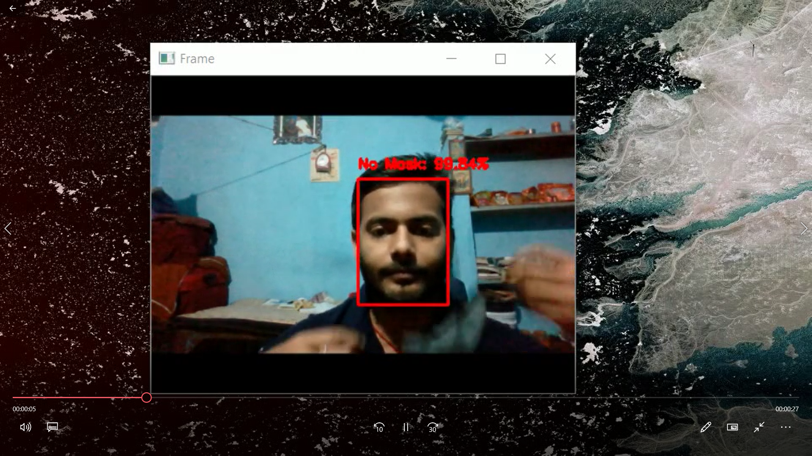
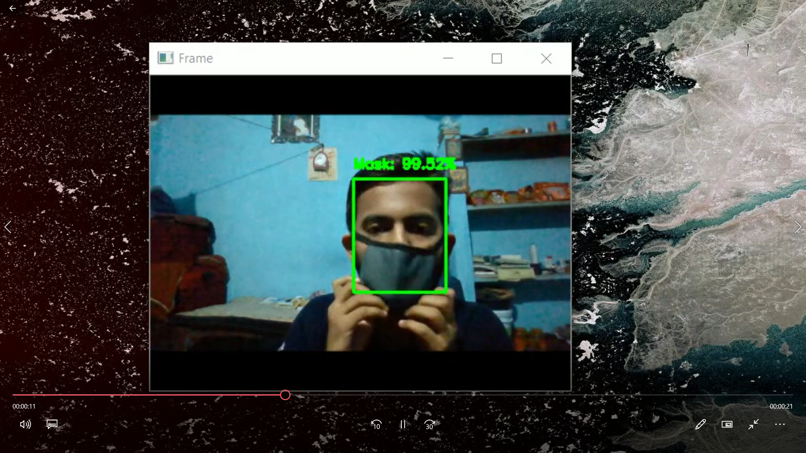
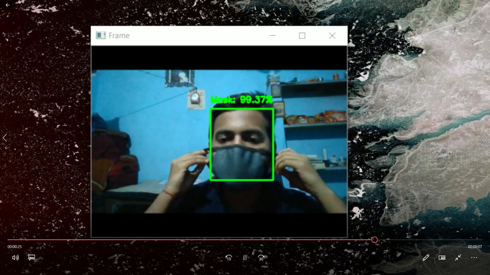

# MASK-DHARAK-SUCHAK-YANTRA -A Mask Detector 

  <h4>Face Mask Detection system built with OpenCV, Keras/TensorFlow using Deep Learning and Computer Vision concepts in order to detect face masks in static images as well as in real-time video streams.</h4>

In the present scenario due to Covid-19, there is no efficient face mask detection applications which are now in high demand for transportation means, densely populated areas, residential districts, large-scale manufacturers and other enterprises to ensure safety. Also, the absence of large datasets of __‘with_mask’__ images has made this task more cumbersome and challenging. 

## Person without mask

## Person with mask

